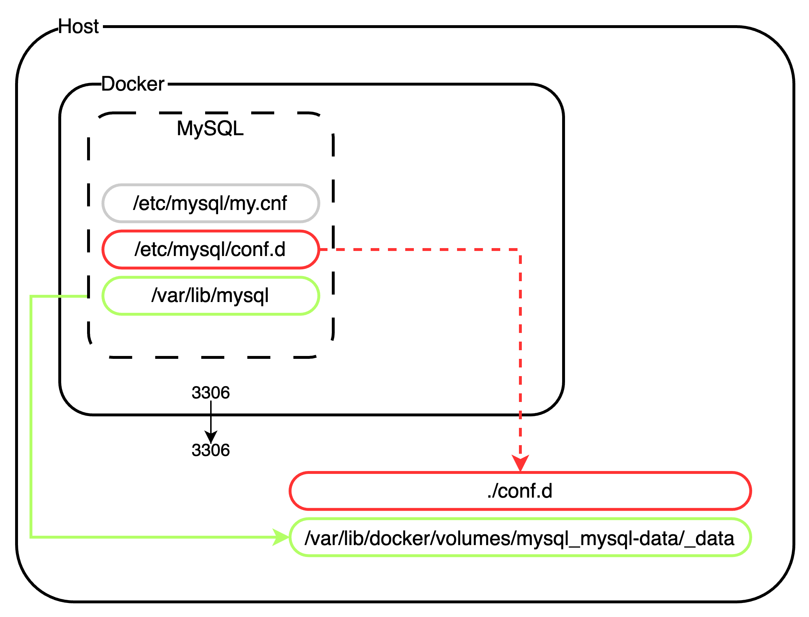

# mysql

This project creates a continer from the official MySQL latest image using Docker Compose.

It demonstrates:

* Using the pre-built image from the official, public repository.
* Protecting sensitive data (MYSQL_ROOT_PASSWORD, MYSQL_USER, and MYSQL_PASSWORD) using Docker secrets.
  * Sensitive data are stored in respective files in an `env` folder that is not commited to the repo. These data are passed to the build process using the Docker secrets pattern. Each of these files contain precisely 1 secret.
* Initialization of a custom databse from a separately created MySQL dump and persisted using a Docker volume.
* Custom MySQL configuration using a Docker bind mount to a `conf.d` folder in the project home. This facilitates effecting configuraiton changes through a container (or mysql server) restart without the need for rebuilding the container.
* Mapping MySQL defaul port 3306 to the host for use of tools like dBeaver or MySQL Workbench in dev environments.



To build/start the container:
```
docker-compose up -d
```

To access the container:
```
docker exec -it mysqld mysql -uroot -p
```
or
```
docker exec -it mysqld bash
```
